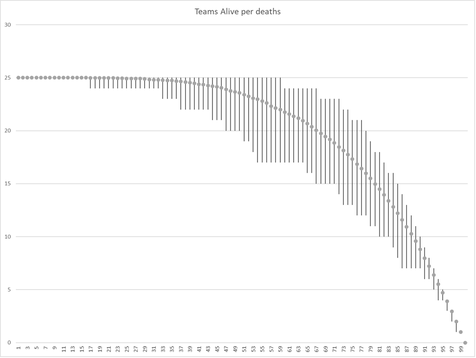
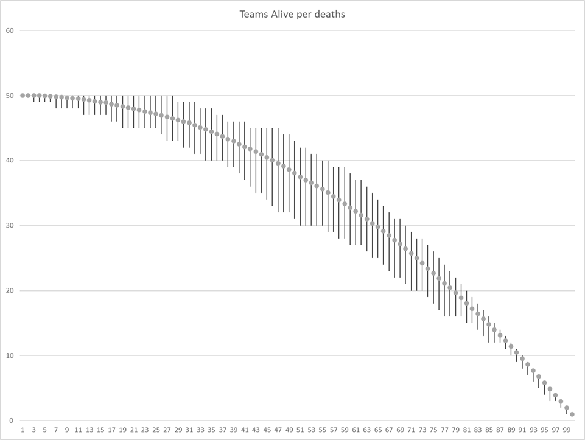
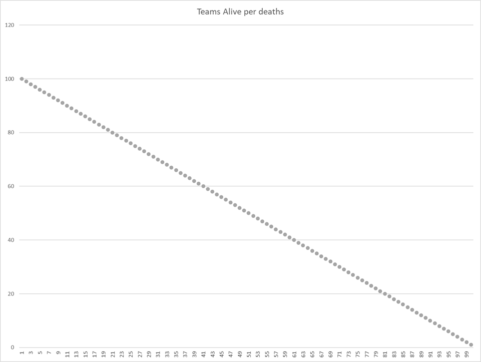

## PUBG death simulation

Program to crunch out data simulating the number of teams left active as individuals are elimated. Each numerical output is the number of teams alive and represents a "death".

Given 100 people in 25 teams of 4, I wanted to find out how many teams are left active given a certain number of people are alive. This program simulates the "deaths" of 100 "individuals" which are grouped into teams and counts the number of teams active for each number of people alive.

The output of several simulations were put into excel (file in repo) and a trend graph of the average, min and max were created. 100 simulations were run for 25 teams of 4, 50 teams of 2 and 100 teams of 1.

Note: this is not a perfect simulation by far. Here, every individual has an equally likely chance of "death", however this is not true in PUBG. Larger squads have a higher chance of surviving encounters, the field, etc are not taken into account. This simulation simply picks one random individual to "die" every turn.

Results are as follows

Squad:

Duo:

Solo:

## Usage

To use:
<pre>
$ <b>./pubgsim</b>
25 25  25  25  25  25  25  25  25  25  25  25  25  25  25  25  25  25  25  25  25  25  25  25  25  25  25  25  25  25  25  25  25  25  25  25  25  25  25  25  24  24  24  24  24  24  23  23  23  23  23  23  23  23  22  22  22  22  22  21  20  20  20  20  20  20  20  19  19  18  18  18  18  17  17  17  16  15  15  14  14  13  13  13  12  12  12  11  10  9   9   8   76  5   4   4   3   2   1
</pre>

To perform multiple (100) simulations (and output to file):
<pre>
$ <b> for i in {00..99}; do ./pubgsim >> out; sleep 1; done;</b>
</pre>
(sleep 1 is necessary as the program's random seeds by the second)

## Installation

Compile with `gcc pubgsim.c -o pubgsim`

## Contributing

Do as you wish, I suppose

## License

MIT
